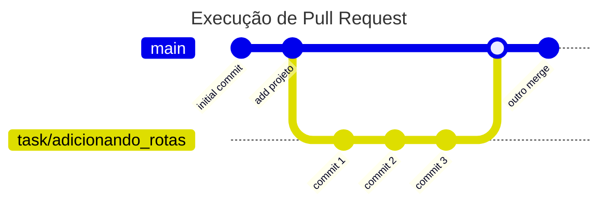

# Vibes App

Um aplicativo para mapear sserviços turísticos no Vale do Capão, Bahia

## Índice

1. [Estrutura](#estrutura)
2. [Dependências](#dependências)
3. [Modo de uso](#modo-de-uso)
4. [Uso do Git](#modo-de-uso-do-git)

## Estrutura

```text
Vides/
├── vibes_app/
├── vibes_api/
├── .gitignore
├── readme.md
├── docker-compose.yml
└── .env
```

## Dependências

- [Docker](https://www.docker.com/)

## Modo de uso do Git

- Crie um arquivo `.env` no diretório root da api com as seguintes configurações:

```text
API_PORT=<8000>
API_HOST=<127.0.0.1>
DB_USER=<user>
DB_PASSWORD=<senha>
```

- run: `docker compose up` ou `docker-compose up`


## Uso do Git

- Criar branch de acordo com o label da issue: `task/<nome_branch>, fix/<nome_branch>`
- Quando finalizar o codigo da branch seguir o seguite git flow:



